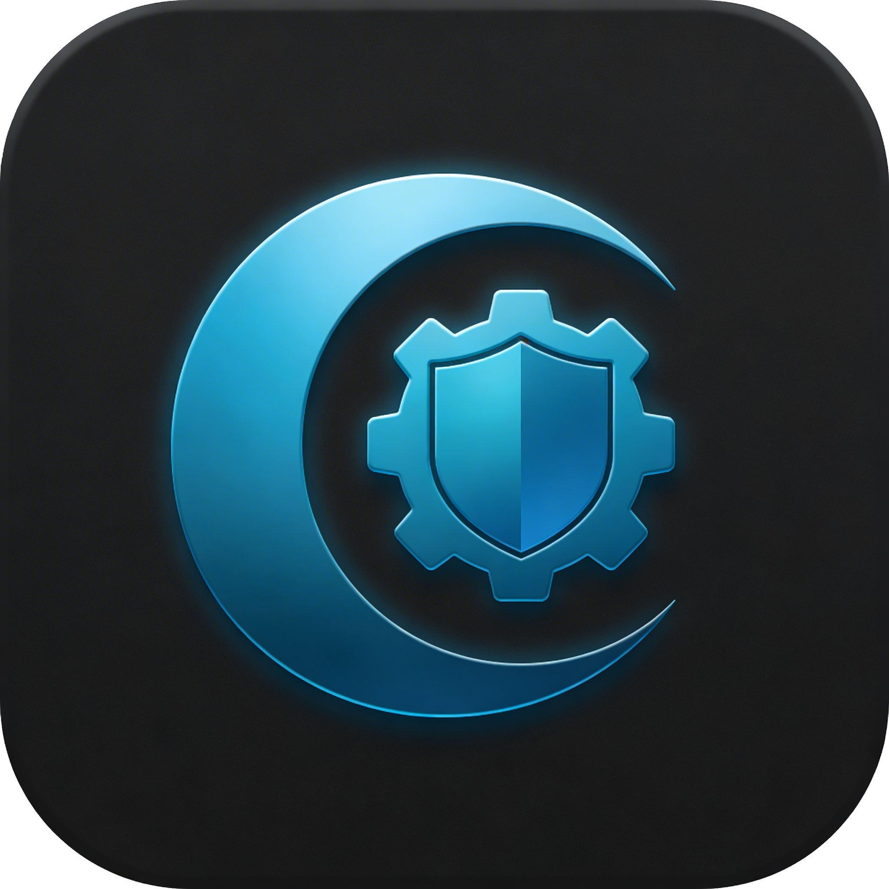
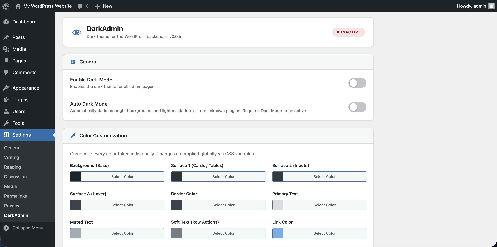
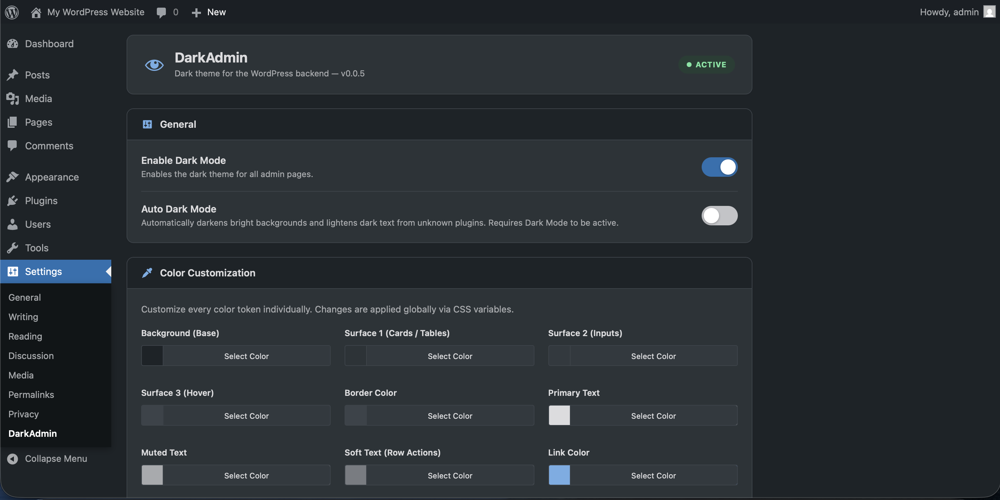
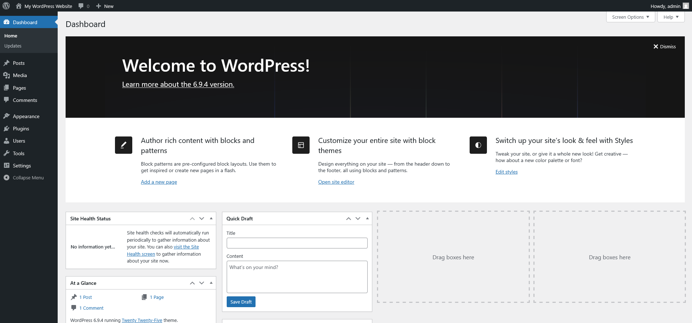
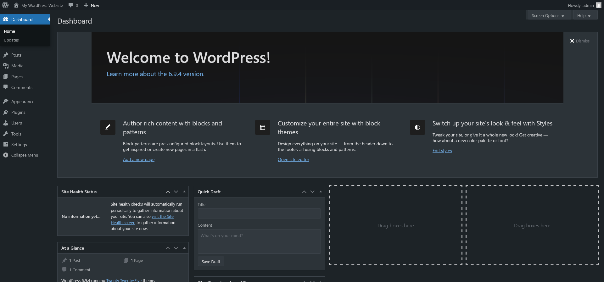

# DarkAdmin - Dark Mode for Adminpanel

A simple, lightweight Dark Mode plugin for the WordPress Admin Dashboard with full color customization and Auto Dark Mode support.

---

## Features

- One-click enable/disable
- Lightweight CSS-based admin theme
- Works across all admin pages
- Individual color customization via WordPress Color Picker
- Custom CSS support using built-in CSS variables
- Token-based design system for backgrounds, text, borders, buttons and states
- Auto Dark Mode: automatically darkens bright plugin backgrounds not covered by the stylesheet
- Preset Themes: choose between Default (WP 6.x) and Modern (WP 7.0) color palettes
- Per-user Dark Mode access control (Include / Exclude) with empty-state UI when no non-admin users exist
- Excluded Pages: specify admin pages where dark mode should not be applied

---

## Installation

1. Upload the plugin folder to `/wp-content/plugins/darkadmin-dark-mode-for-adminpanel/`
2. Activate through **Plugins** in WordPress
3. Go to **Settings > DarkAdmin** and enable it

---

## Screenshots

| Settings - Dark Mode off | Settings - Dark Mode on |
|---|---|
|  |  |

| Dashboard - Dark Mode off | Dashboard - Dark Mode on |
|---|---|
|  |  |

---

## Changelog
## [0.2.1] - 2026-03-28

### Changed
- Lowered minimum WordPress version requirement from 6.7 to 6.3

### Added
- Dark mode styles for Thickbox modal (plugin details dialog): background, text, links, buttons and close button fully themed via `--adm-*` variables

### Fixed
- Fixed theme overlay header navigation buttons (`.theme-overlay .theme-header .left` / `.right` / `.close`): applied background, color and `border: none` using `--adm-*` variables in both `darkadmin-dark.css` and `darkadmin-wp-modern.css`
- Fixed `#contextual-help-back` button styling: background, border and color now use `--adm-*` tokens in both CSS presets

### 0.2.0
- Raised minimum WordPress version to 6.7
- Raised minimum PHP version requirement to 8.0 (already required by existing use of `str_starts_with`, `str_contains` and named arguments)
- Added defer loading strategy to `darkadmin-settings-js` and `darkadmin-auto-darken` via the `strategy` argument introduced in WordPress 6.3
- Fixed: replaced inline `echo '<script>'` in `settings-page.php` with `wp_add_inline_script()`
- Fixed: replaced anonymous arrow function sanitize callbacks in `register_setting()` with named functions `darkadmin_sanitize_bool()`, `darkadmin_sanitize_user_ids()` and `darkadmin_sanitize_preset()`
- Fixed: used strict boolean check (`true === $value`) instead of loose cast in `darkadmin_sanitize_bool()`
- Fixed: removed direct `$_POST` access in `darkadmin_sanitize_colors()` and `darkadmin_sanitize_layout()`; preset value now read from `$input` array
- Fixed: added `shadow_md` value validation against a safe CSS pattern in `darkadmin_sanitize_layout()`
- Fixed: added late escaping via `wp_strip_all_tags()` to both `wp_add_inline_style()` calls for `$vars` and `$custom`
- Fixed: renamed generic JS object names `admData` and `admI18n` to `darkadminData` and `darkadminI18n` in `enqueue.php` and `settings.js`
- Added i18n string `"Copied!"` to `enqueue.php` via `wp_localize_script` (`darkadminI18n.copied`)
- Fixed: replaced hardcoded `'Copied!'` string in `settings.js` `initVarCopy()` with `darkadminI18n.copied` for full translateability
- Fixed: replaced `innerHTML` with `textContent` in `initVarCopy()` to prevent potential XSS
- Updated all language files (`.pot`, `de_AT`, `de_DE`, `en_US`): added `Copied!` / `Kopiert!` translation, bumped version to 0.1.3, updated timestamps
- Fixed: added missing `@package DarkAdmin` tag to `darkadmin.php` file comment
- Fixed: `add_filter()` and `add_action()` calls in `darkadmin.php` now comply with WPCS multi-line function call rules (opening parenthesis last on line, one argument per line, closing parenthesis on its own line)
- Fixed: equals sign alignment for `$has_users` in `settings-page.php` (7 spaces expected)
- Fixed: closing PHP tag not on its own line in `settings-page.php` (`$prev` assignment block)
- Fixed: opening PHP tag not on its own line in `settings-page.php` (`$current_color` block)
- Fixed: replaced short ternary `?:` with explicit `isset()` check and full ternary for `$current_color` in `settings-page.php`
- Fixed: incorrect indentation in `settings-page.php` (10 tabs expected, 9 found)
- Fixed: Yoda conditions for all comparisons in `settings-page.php`
- Fixed: replaced inline control structure with braced block in `settings-page.php`
- Fixed: replaced `$_GET['page']` with `get_current_screen()` in `enqueue.php` to avoid direct superglobal access
- Fixed: added `current_user_can()` capability check at the top of `darkadmin_settings_page()` in `settings-page.php`
- Fixed: added missing `darkadmin_layout` option cleanup in `uninstall.php`
- Fixed: proper UTF-8 umlauts in `readme-de.txt` (replaced ASCII substitutions with correct characters)
- Fixed: replaced escaped HTML entity checkmark with literal UTF-8 character in preset button (`settings-page.php`)

### 0.1.2
- Added dedicated Sidebar color group with three new tokens: Sidebar Background (`--adm-sidebar-bg`), Sidebar Active Item (`--adm-sidebar-active`), Sidebar Text (`--adm-sidebar-text`)
- Added sidebar token translations to all language files (`de_AT`, `de_DE`, `en_US`, `.pot`, `.l10n.php`)
- Added layout token system (spacing, radius, shadow) with per-preset defaults and settings UI
- Unified layout tokens across presets, added layout JS handlers, updated all language files
- Added `.adm-layout-grid` CSS: 4-column grid with responsive breakpoints and dark mode overrides
- Improved color picker swatch display in settings page
- Fixed `translators` comment and `phpcs:ignore` placement in `settings-page.php`
- Fixed: replaced `&amp;` HTML entity with literal UTF-8 ampersand in i18n strings (`settings-page.php`)
- Fixed: replaced PHP `\u2713` escape with literal UTF-8 checkmark character in admin notice strings
- Fixed: replaced `&#10003;` HTML entity with literal UTF-8 checkmark in preset button PHP and all `.po` files
- Fixed: replaced ASCII-escaped umlauts with proper UTF-8 characters in all language files, added missing msgids (checkmark "Active", em-dash in admin notice)
- Updated `darkadmin-dark.css` and `darkadmin-wp-modern.css`

### 0.1.1
- Fixed `uninstall.php`: corrected all option names from wrong `adm_` prefix to `darkadmin_` prefix so options are properly removed on plugin deletion

### 0.1.0
- Added support for excluded pages in settings
- Added user access control (include/exclude users)
- Added preset themes (default and modern)
- Fixed critical JS bugs in preset and reset functionality
- Fixed missing closing brace in `initPaletteIO()` importFile block in `settings.js`
- Fixed XSS vulnerability in `printf` output (`settings-page.php`)
- Fixed Unicode escapes in language files: replaced `\uXXXX` sequences with literal UTF-8 characters
- Added `admI18n` JS localization via `wp_localize_script` for translated UI strings
- Removed redundant `wp-color-picker` script enqueue
- Added `.l10n.php` language cache files for all locales (`de_AT`, `de_DE`, `en_US`) with ABSPATH protection
- Added hex validation for JSON palette imports
- Updated documentation for new features

### 0.0.10
- Extended Themes section: added dark styling for `.theme-browser .theme .theme-name`, `.theme-overlay .theme-actions`, `.theme-overlay .theme-tags`, `.theme-overlay .theme-header .theme-title`, `.theme-overlay .theme-author`, `.theme-overlay .theme-version` and `.theme-overlay .theme-rating .star-rating .star`
- Added Theme Editor / Template Side section: dark styling for `#templateside > ul`, `.importer-title` and `.color-option.selected` / `.color-option:hover`
- Reduced `.cm-error` background opacity from `.15` to `.05` for a more subtle error highlight in CodeMirror
- All changes applied to both `darkadmin-dark.css` and `darkadmin-wp-modern.css`
- Fixed invalid control sequences in all language files (`de_AT`, `de_DE`, `en_US`, `.pot`): replaced `\uXXXX` Unicode escapes with literal UTF-8 characters to resolve `msgfmt` compilation errors
- User Access: Include and Exclude options are now greyed out and non-clickable when no non-administrator users exist
- User Access: replaced plain text fallback with a styled empty-state block
- i18n: added missing "No non-administrator users found" string to all language files

### 0.0.9
- Added Preset Themes: Default (WP 6.x classic dark) and Modern (WP 7.0 deep blue)
- Each preset ships with its own CSS file loaded dynamically based on the active preset
- Added `adm_preset` option with live preset switching
- Added per-user Dark Mode with User Access card
- Added live color preview (instant CSS variable updates without saving)
- Added Export / Import palette as JSON
- Added custom CSS sanitizer (`adm_sanitize_custom_css`)
- Added CSS cache-busting based on `md5` hash of current color values
- Refactored plugin into modular includes
- Added `uninstall.php` for clean removal
- Color pickers grouped by category
- Expanded color tokens from 23 to 34

### 0.0.8
- Fixed invisible text in `.widefat` tables

### 0.0.7
- Added version to `darkadmin-dark.css` header comment

### 0.0.6
- Updated Text Domain to `darkadmin-dark-mode-for-adminpanel`
- Updated Plugin URI to wordpress.org
- Updated all language files to new text domain

### 0.0.5
- Rebranded from "WP Admin Dark Mode" to "DarkAdmin - Dark Mode for Adminpanel"
- Renamed main files, CSS files, text domain and menu slug
- Updated all language files

### 0.0.4
- Added Auto Dark Mode with WCAG luminance calculations
- Auto Dark Mode uses `MutationObserver` for AJAX-loaded content
- Fixed color picker swatch visibility
- Updated all translation files

### 0.0.3
- Full CSS overhaul with token-based design system
- Added new color variables
- Increased color tokens from 9 to 13
- Various styling fixes and layout improvements

### 0.0.2
- Redesigned settings page with card-based layout
- Added individual color customization via WordPress Color Picker
- Added Custom CSS editor
- All colors now driven by CSS custom properties

### 0.0.1
- Initial development release.

---

## License

[GPLv2 or later](https://www.gnu.org/licenses/gpl-2.0.html)

---

---

# DarkAdmin - Dark Mode für das Adminpanel

Ein einfaches, schlankes Dark-Mode-Plugin für das WordPress Admin-Dashboard mit vollständiger Farbanpassung und Auto-Dark-Mode-Unterstützung.

---

## Funktionen

- Ein-Klick aktivieren/deaktivieren
- Leichtgewichtiges CSS-basiertes Admin-Theme
- Funktioniert auf allen Admin-Seiten
- Individuelle Farbanpassung über den WordPress Color Picker
- Unterstützung für eigenes Custom CSS mit eingebauten CSS-Variablen
- Token-basiertes Design-System für Hintergründe, Texte, Rahmen, Buttons und Statusfarben
- Auto Dark Mode: Verdunkelt automatisch helle Plugin-Hintergründe, die vom Stylesheet nicht abgedeckt werden
- Preset-Themes: Wechsel zwischen Default (WP 6.x) und Modern (WP 7.0) Farbpaletten
- Benutzerspezifische Dark-Mode-Zugriffskontrolle (Einschließen / Ausschließen) mit Empty-State-UI wenn keine Nicht-Admin-Benutzer vorhanden sind
- Ausgeschlossene Seiten: Admin-Seiten angeben, auf denen Dark Mode nicht angewendet werden soll

---

## Installation

1. Lade den Plugin-Ordner nach `/wp-content/plugins/darkadmin-dark-mode-for-adminpanel/` hoch
2. Aktiviere das Plugin in WordPress unter **Plugins**
3. Gehe zu **Einstellungen > DarkAdmin** und aktiviere es

---

## Changelog

## 0.2.1

### Geändert
- Mindestanforderung für WordPress-Version von 6.7 auf 6.3 gesenkt

### Hinzugefügt
- Dark-Mode-Stile für Thickbox-Modal (Plugin-Details-Dialog): Hintergrund, Text, Links, Buttons und Schließen-Button vollständig über `--adm-*`-Variablen gestylt

### Behoben
- Theme-Overlay-Header-Navigationsbuttons (`.theme-overlay .theme-header .left` / `.right` / `.close`) korrigiert: Hintergrund, Farbe und `border: none` mit `--adm-*`-Variablen in beiden Dateien `darkadmin-dark.css` und `darkadmin-wp-modern.css` angewendet
- Styling des `#contextual-help-back`-Buttons korrigiert: Hintergrund, Rahmen und Farbe verwenden nun `--adm-*`-Tokens in beiden CSS-Presets

### 0.2.0
- Mindest-WordPress-Version auf 6.7 angehoben
- Mindest-PHP-Version auf 8.0 angehoben (bereits erforderlich durch Verwendung von `str_starts_with`, `str_contains` und Named Arguments)
- Defer-Ladestrategie für `darkadmin-settings-js` und `darkadmin-auto-darken` via `strategy`-Argument (eingeführt in WordPress 6.3) hinzugefügt
- Fix: Inline-`echo '<script>'` in `settings-page.php` durch `wp_add_inline_script()` ersetzt
- Fix: Anonyme Arrow-Function-Sanitize-Callbacks in `register_setting()` durch benannte Funktionen `darkadmin_sanitize_bool()`, `darkadmin_sanitize_user_ids()` und `darkadmin_sanitize_preset()` ersetzt
- Fix: Strikten Boolean-Check (`true === $value`) statt losem Cast in `darkadmin_sanitize_bool()` verwendet
- Fix: Direkten `$_POST`-Zugriff in `darkadmin_sanitize_colors()` und `darkadmin_sanitize_layout()` entfernt; Preset-Wert wird nun aus dem `$input`-Array gelesen
- Fix: `shadow_md`-Wert-Validierung gegen sicheres CSS-Pattern in `darkadmin_sanitize_layout()` hinzugefügt
- Fix: Spätes Escaping via `wp_strip_all_tags()` zu beiden `wp_add_inline_style()`-Aufrufen für `$vars` und `$custom` hinzugefügt
- Fix: Generische JS-Objektnamen `admData` und `admI18n` in `enqueue.php` und `settings.js` zu `darkadminData` und `darkadminI18n` umbenannt
- i18n-String `"Copied!"` in `enqueue.php` via `wp_localize_script` (`darkadminI18n.copied`) hinzugefügt
- Fix: Hardcodierten `'Copied!'`-String in `settings.js` `initVarCopy()` durch `darkadminI18n.copied` ersetzt für vollständige Übersetzbarkeit
- Fix: `innerHTML` in `initVarCopy()` durch `textContent` ersetzt (verhindert potenzielles XSS)
- Alle Sprachdateien aktualisiert (`.pot`, `de_AT`, `de_DE`, `en_US`): `Copied!` / `Kopiert!`-Übersetzung hinzugefügt, Version auf 0.1.3 angehoben, Zeitstempel aktualisiert
- Fix: Fehlendes `@package DarkAdmin` Tag im Datei-Kommentar von `darkadmin.php` ergänzt
- Fix: `add_filter()`- und `add_action()`-Aufrufe in `darkadmin.php` auf WPCS-konforme Multi-line-Syntax umgestellt (öffnende Klammer letzte Sache auf der Zeile, jedes Argument auf eigener Zeile, schließende Klammer auf eigener Zeile)
- Fix: Gleichheitszeichen-Ausrichtung für `$has_users` in `settings-page.php` korrigiert (7 Leerzeichen erwartet)
- Fix: Schließendes PHP-Tag nicht auf eigener Zeile in `settings-page.php` behoben (`$prev`-Zuweisung)
- Fix: Öffnendes PHP-Tag nicht auf eigener Zeile in `settings-page.php` behoben (`$current_color`-Block)
- Fix: Short-Ternary `?:` durch explizites `isset()`-Check und vollständiges Ternary für `$current_color` in `settings-page.php` ersetzt
- Fix: Falsche Einrückung in `settings-page.php` korrigiert (10 Tabs erwartet, 9 gefunden)
- Fix: Yoda-Bedingungen für alle Vergleiche in `settings-page.php` korrigiert
- Fix: Inline-Kontrollstruktur durch Block mit geschweiften Klammern in `settings-page.php` ersetzt
- Fix: `$_GET['page']` durch `get_current_screen()` in `enqueue.php` ersetzt (kein direkter Superglobal-Zugriff)
- Fix: `current_user_can()`-Berechtigungsprüfung am Anfang von `darkadmin_settings_page()` in `settings-page.php` hinzugefügt
- Fix: Fehlende `darkadmin_layout`-Option-Bereinigung in `uninstall.php` ergänzt
- Fix: Korrekte UTF-8-Umlaute in `readme-de.txt` (ASCII-Ersetzungen durch korrekte Zeichen ersetzt)
- Fix: Escaptes HTML-Entity-Häkchen durch direktes UTF-8-Zeichen im Preset-Button (`settings-page.php`) ersetzt

### 0.1.2
- Neue Sidebar-Farbgruppe hinzugefügt mit drei neuen Tokens: Sidebar-Hintergrund (`--adm-sidebar-bg`), Sidebar aktives Element (`--adm-sidebar-active`) und Sidebar-Text (`--adm-sidebar-text`)
- Sidebar-Token-Übersetzungen in alle Sprachdateien eingetragen (`de_AT`, `de_DE`, `en_US`, `.pot`, `.l10n.php`)
- Layout-Token-System hinzugefügt (Spacing, Radius, Shadow) mit per-Preset-Defaults und Settings-UI
- Layout-Tokens über Presets vereinheitlicht, Layout-JS-Handler hinzugefügt, alle Sprachdateien aktualisiert
- `.adm-layout-grid` CSS hinzugefügt: 4-Spalten-Grid mit responsiven Breakpoints und Dark-Mode-Overrides
- Darstellung der Color-Picker-Swatches in der Einstellungsseite verbessert
- Fix: `translators`-Kommentar und `phpcs:ignore` in `settings-page.php` korrekt gesetzt
- Fix: `&amp;` HTML-Entity durch direktes UTF-8-Ampersand in i18n-Strings ersetzt (`settings-page.php`)
- Fix: PHP `\u2713`-Escape durch direktes UTF-8-Häkchen in Admin-Notice-Strings ersetzt
- Fix: `&#10003;` HTML-Entity durch direktes UTF-8-Häkchen im Preset-Button-PHP und allen `.po`-Dateien ersetzt
- Fix: ASCII-escaped Umlaute durch korrekte UTF-8-Zeichen in allen Sprachdateien ersetzt, fehlende msgids ergänzt
- `darkadmin-dark.css` und `darkadmin-wp-modern.css` aktualisiert

### 0.1.1
- Behoben: `uninstall.php` korrigiert -- alle Optionsnamen vom falschen `adm_`-Prefix auf den korrekten `darkadmin_`-Prefix geändert

### 0.1.0
- Unterstützung für ausgeschlossene Seiten in den Einstellungen hinzugefügt
- Benutzerzugriffskontrolle hinzugefügt (Benutzer ein-/ausschließen)
- Voreingestellte Designs hinzugefügt (Standard und Modern)
- Kritische JavaScript-Fehler behoben
- Fehlende schließende geschweifte Klammer in `initPaletteIO()` behoben
- XSS-Sicherheitslücke in `printf`-Ausgabe behoben
- Unicode-Escapes in Sprachdateien behoben
- `admI18n` JS-Lokalisierung via `wp_localize_script` hinzugefügt
- Redundantes `wp-color-picker` Script-Enqueue entfernt
- `.l10n.php` Sprach-Cache-Dateien hinzugefügt
- Hexadezimalvalidierung für JSON-Palettenimporte hinzugefügt

### 0.0.10
- Themes-Bereich erweitert mit Dark-Styling für Theme-Browser und Theme-Editor-Elemente
- `.cm-error`-Hintergrund-Deckkraft von `.15` auf `.05` reduziert
- Ungültige Steuerzeichen in allen Sprachdateien behoben
- Benutzerzugriff: Einschließen- und Ausschließen-Optionen werden ausgegraut wenn keine Nicht-Administrator-Benutzer vorhanden sind
- Benutzerzugriff: Einfachen Text-Fallback durch gestalteten Empty-State-Block ersetzt
- i18n: fehlenden String in allen Sprachdateien ergänzt

### 0.0.9
- Preset-Themes hinzugefügt (Default und Modern)
- Benutzerspezifischer Dark Mode mit User-Access-Karte
- Live-Farbvorschau hinzugefügt
- Export / Import der Farbpalette als JSON-Datei
- CSS-Cache-Busting hinzugefügt
- Plugin in modulare Includes aufgeteilt
- Farb-Tokens von 23 auf 34 erweitert

### 0.0.8
- Unsichtbaren Text in `.widefat`-Tabellen behoben

### 0.0.7
- Version in den `darkadmin-dark.css` Header-Kommentar eingefügt

### 0.0.6
- Text Domain auf `darkadmin-dark-mode-for-adminpanel` aktualisiert
- Alle Sprachdateien aktualisiert

### 0.0.5
- Plugin von "WP Admin Dark Mode" zu "DarkAdmin - Dark Mode for Adminpanel" umbenannt
- Hauptdateien, CSS-Dateien, Text-Domain und Menü-Slug umbenannt

### 0.0.4
- Auto Dark Mode mit WCAG-Luminanzberechnungen hinzugefügt
- Auto Dark Mode verwendet `MutationObserver` für AJAX-geladene Inhalte
- Farbfeld-Anzeige des Color Pickers korrigiert

### 0.0.3
- Komplettes CSS-Refactoring mit token-basiertem Design-System
- Neue anpassbare Farbvariablen hinzugefügt
- Anzahl der Farb-Tokens von 9 auf 13 erhöht

### 0.0.2
- Einstellungsseite komplett neu gestaltet mit Card-Layout
- Individuelle Farbanpassung über den WordPress Color Picker
- Custom-CSS-Editor hinzugefügt
- Alle Dark-Mode-Farben basieren nun auf CSS-Custom-Properties

### 0.0.1
- Erste Development-Version.

---

## Lizenz

[GPLv2 or later](https://www.gnu.org/licenses/gpl-2.0.html)

---

*Entwickelt von [AlexanderWagnerDev](https://alexanderwagnerdev.com)*
